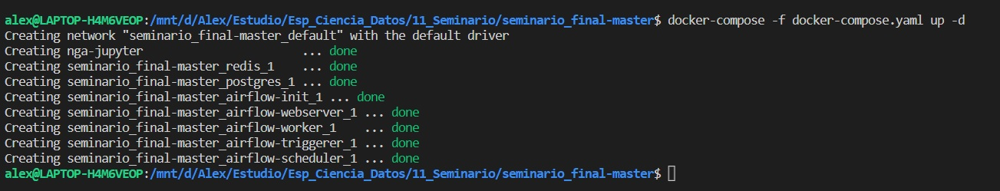

# Seminario de Tópicos Avanzados en Datos Complejos
### Especialización en ciencia de datos ITBA  
  
  
  
Docentes:   
Pedro Ferrari | pedro@muttdata.ai  
Juan Martín Pampliega | jpamplie@itba.edu.ar  

Estudiantes:      
Guillermo Lencina | glencina@itba.edu.ar    
Nicolas Arosteguy | narosteguy@itba.edu.ar    
Alexander Chavez | achavezmontano@itba.edu.ar   
  
  
## Resumen

Se consultarán dos API's publicas de spotify, una con información de usuarios y sus playlist y otra con la información de las playlist perse.  
  
En una primera instancia mediante un script de python (y con usuarios pre-seleccionados manualmente) se obtienen datos de los mismos que contienen las playlist que tengan creadas.  
  
La salida del  response es almacenada en un csv (users_file.csv) sin tranformar, y subido a la base de datos SEMINARIO en el schema staging ( donde almacenaremos los csv en tablas sin transformar ).  
  
Luego mediante Queries de SQL se ejecutan diferentes transformaciones para lograr extraer y estructurar de la tabla de staging de usuarios tanto los datos de los mismos como sus playlist.  
  
Una vez construidas las tablas de usuarios y playlist en el eschema public , con un segundo script de python obtenemos estos id de playlist ya procesados y consultamos la API de playlist, de donde obtenemos un 2do csv (playlist_file.csv) que será almacenado también en el schema de staging, sin procesar.  
  
Nuevamente con Queries SQL extraemos y estructuramos la tabla de playlist_artist, en donde vamos a poder obtener que artistas contiene cada playlist.  
  
Por último, con SQL, se genera una tabla con información (user_id, artista), vinculando todos los artistas que se hayan encontrado en las playlist con sus respectivos usuarios.  
  
Esta ultima información es exportada en un csv (export_colab.csv) para ser el input del colab y empezar con los algoritmos de clusterización.  
  
Todas estas tareas estarán osquestadas mediante operadores de airflow ( Postgres Operators y Python Operators)  
  
  
## Objetivo    
  
Obtener datos sobre que artistas que escuchan los usuarios en sus playlists publicas con el fin de prototipar la extraccióon, el procesamiento, y los análisis de la información para un futuro sistema de recomendacion basado en las coincidencias de artistas entre los usuarios.

## Contenido

* [Infraestructura](#Infraestructura)
* [Instalación y puesta en marcha del ambiente](#Pasos-para-instalar)
* [Jupyter Notebook](jupyter/notebook/README.md)
* [Airflow (DAGs configurados en _users_spotify.py_)](dags/README.md)
  
    
## Infraestructura  
  
Nuestro trabajo simula una instalación de producción con múltiples containers en Docker.
_docker-compose.yaml_ contiene las definiciones y configuraciones para los siguientes servicios:

* Interfaz gráfica de Jupyter obtenida de la imagen arjones/pyspark:2.4.5. 

    Una vez los containers estén en Running, podés ingresar desde acá -> [Jupyter](http://localhost:8888)

* Interfaz gráfica de Airflow obtenida de la imagen -apache/airflow:2.4.1. 

    Una vez los containers estén en Running, podés ingresar desde acá -> [Airflow](http://localhost:8080)

* Motor de base de datos postgres obtenida de la imagen postgres:13. 

## Pasos para instalar

1. Clonar repo: git clone https://github.com/guillelencina/seminario_final.git

2. Abrir _Docker Desktop_ para visualizar desde la interfaz.

3. Desde VSCode, abrir la carpeta _seminario_final-master_.

4. Ejecutar una consola de Ubuntu.

5. Ingresar a la carpeta: cd seminario_final-master

6. Ejecutar el comando: docker-compose -f docker-compose.yaml up -d

* El docker-compose es un archivo yaml/yml para crear todos los containers necesarios y a la vez.
* Una vez ejecutado, deben aparecer todos los containers OK como indica la imagen.

* También los podés chequear en la interfaz gráfica de Docker.

Sitios de interés: 

    * https://www.youtube.com/c/PeladoNerd  
    * https://www.youtube.com/c/HolaMundoDev  
    * https://www.youtube.com/c/NetworkChuck
    * Postgres + PGAdmin : https://www.youtube.com/watch?v=uKlRp6CqpDg  

## Acerca de

Nicolás Arostegui | [LinkedIn](https://www.linkedin.com/in/nicol%C3%A1s-arosteguy-a564a97a/) 

Guillermo Lencina | [LinkedIn](https://www.linkedin.com/in/guillermolencina/) 

Alexander Chavez | [LinkedIn](https://www.linkedin.com/in/alexchavez1980/) 

ITBA &copy; 2021/2022 
